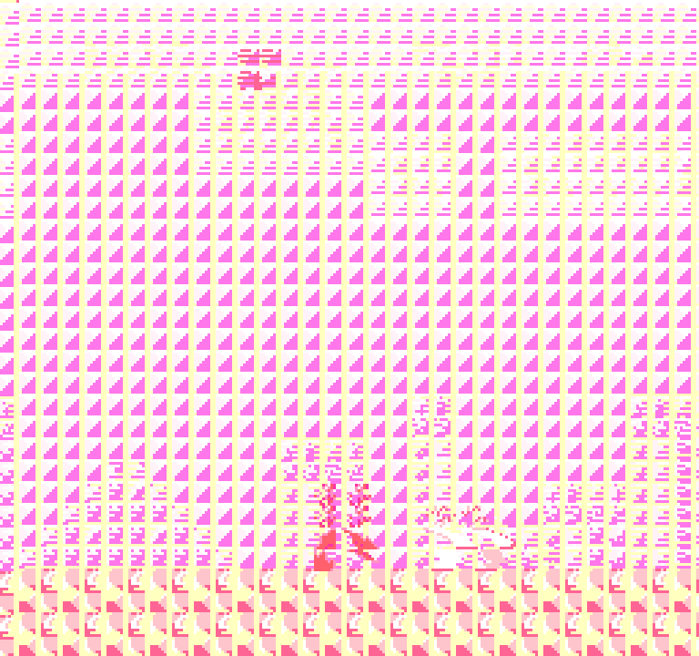

# NEZ - NES Emulator

A Nintendo Entertainment System (NES) emulator **vibe-coded** in Python.  

An experiment to see how close to a working emulator I can get, using both Warp and GitHub Copilot with various incantations of prompts and models. I'll write a bit more about this later if it gets close to working. I'm reviewing basically none of the generated code, instead I'm just giving the LLMs feedback based on my experience when running the emulator and steering it on areas I think it may need to focus on.  


### Updates

#### August 2025

Right now it can _kind_ of load some games/ROMs, but theres a ton of corruption and performance is terrible!

I had assumed that being a 40 year old, incredibly well documented platform, that the LLMs may have been able to build this relatively easily. So far it's been a nightmare, but I'm stubborn so going to keep nudging this along.

#### September 2025

This project was a horrible idea. LLMs are creating a mess. Python isn't fast enough. I will revisit this down the line and see if AI is at a point where this is less painful!

#### February 2026

Revisited with Opus 4.6. Had it review/update the codebase with a view to adding any missing or incomplete functions. I then had it add a headless mode, so that it could run the emulator itself and quickly gather stats. Eventually it profiled itself and we made the decision to move most of core logic to Cython (the pyx files) which has made a huge difference. I knew from the get-go that getting this to run on pure Python was a long shot, but this seems like a good compromise for now. 

## Screenshots

Feb 2026, with latest Opus model, its basically working! Framerate isn't great but it's playable:  
<p align="center">
    
</p>

Earlier/2025 screenshots:  
<p align="center">
    
</p>
<p align="center">
    
</p>
<p align="center">
    
</p>


## Things I have found are not great when attempting this

- Can blow through a months Warp quota in a couple of hours when asking it to dive deep into implementing/reviewing logs. Copilot isn't much better. This experiment is doing a lot of iterating/scanning huge log output so perhaps understandable, but it doesn't feel like you get many credits for your money.
- GitHub Copilot can't read zsh terminal output properly. Switching it to bash seems to be more reliable.
- GitHub Copilot can't auto run commands, so have to repeatedly click to allow it to grep logs, etc. It looks like they might be fixing this soon.
- GitHub Copilot seems to hardly ever consider the `copilot-instructions.md` file.
- The "lower" models (GPT <5, the free models with copilot, gemini) are often lazy and like to either propose changes vaguely, and not actually implement them even though they are in agent mode. Or they don't consider the full context, often deleting large swathes of code with placeholders like `# Rest of code here`. Sometimes I catch this, but I'm mostly not reviewing the code. Instead, commit often and revert if it seems to have regressed. I'm sure the spaghetti factor here is horrendous as a result.
- The lower models often like to duplicate functions. Again it seems that they are not reviewing/considering the full context of the codebase (even when asked). Often times I've had to tell it to go and consolidate duplicate/similar methods. Similarly they have a tendency to create placeholder or stub methods.
- As a result, using non-premium models is basically pointless / will result in a mess and set you back.

## Prerequisites

- **Python 3.13+**
- **pipenv** — install with `pip install pipenv` if you don't have it

The Pipfile pulls in [PySDL2](https://pypi.org/project/PySDL2/) (plus the bundled SDL2 binary), [Pillow](https://pypi.org/project/Pillow/) for screenshots, [Cython](https://cython.org/) for the accelerated PPU/APU/CPU, and a few build utilities.

## Installation

```bash
pipenv install
```

This creates a virtualenv and installs all runtime dependencies.

### Building the Cython extensions (required)

The PPU, APU, and CPU are implemented as Cython (`.pyx`) modules and **must be compiled** before running the emulator.

```bash
pipenv run python setup.py build_ext --inplace
```

This compiles `ppu.pyx`, `apu.pyx`, and `cpu.pyx` into native C extensions (`.so` on macOS/Linux, `.pyd` on Windows). You only need to rebuild after modifying a `.pyx` file.

## Usage

The easiest way to run the emulator is via `run.sh`, which automatically builds the Cython extensions before launching:

```bash
./run.sh <rom_file>
```

For example:

```bash
./run.sh mario.nes
```

Or run manually after building:

```bash
pipenv run python main.py mario.nes
```

### Headless Mode

Run without opening an SDL window. The emulator runs for a set duration, prints periodic stats, and saves a final screenshot:

```bash
pipenv run python main.py mario.nes --headless
pipenv run python main.py mario.nes --headless --duration 120 --screenshot output.png
```

- `--headless` — Run without a window (no SDL). Prints progress and saves a screenshot on exit.
- `--duration <seconds>` — How many seconds to run in headless mode (default: `60`).
- `--screenshot <path>` — File path for the headless-mode screenshot (default: `headless_screenshot.png`).

### Debug Headless Runner

A separate script (`headless_run.py`) is available for debug-oriented headless runs with frame-level control and PPU log filtering:

```bash
pipenv run python headless_run.py mario.nes --frames 120 --out full.log --hits spr0.log
```

- `--frames <n>` — Number of frames to run (default: `90`).
- `--out <path>` — Path to write full debug log output.
- `--hits <path>` — Path to write filtered sprite-0 hit lines.
- `--continue-after-hit` — Don't stop early when a sprite-0 hit occurs; run the full frame count.

### Controls

**Player 1**

- Arrow Keys — D-Pad
- J — A Button
- K — B Button
- Right Shift — Select
- Enter — Start

**Player 2**

- W/A/S/D — D-Pad
- G — A Button
- H — B Button
- Tab — Select
- Space — Start

**General**

- R — Reset System
- F12 — Take Screenshot
- Escape — Quit

## Contributions

Contributions are welcome! Feel free to throw up a PR if you know of any changes that could help!
